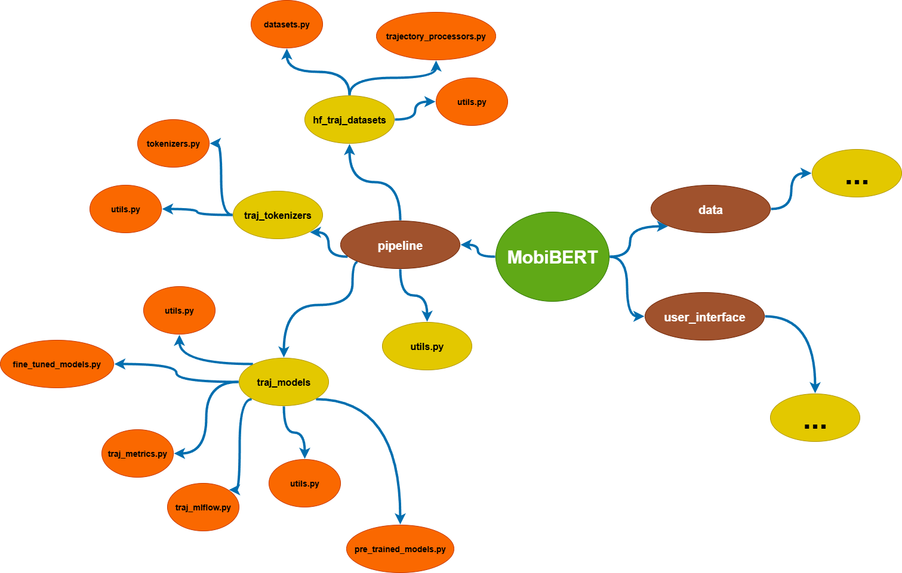
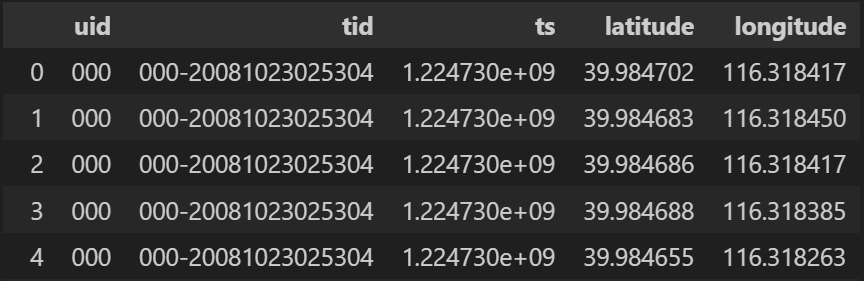
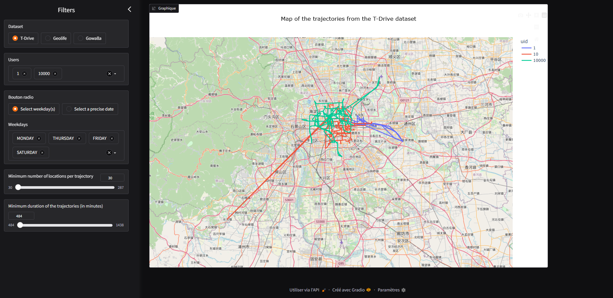
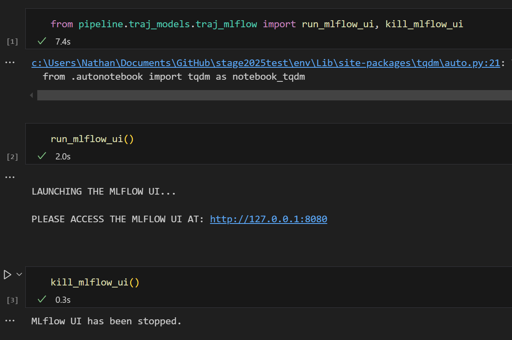
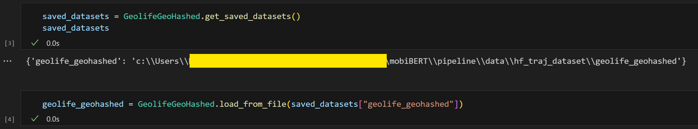

# <p style="text-align:center;">👋 **Welcome to the MobiBERT library!** 👋</p>

<br>

**_MobiBERT_** is an ML library that enables the development of **Deep Learning models** to process **Trajectory Data**.  

<br>

The MobiBERT library provides two main features/packages, included in the `mobiBERT` folder:  

- <ins>**The Gradio User Interface:**</ins> A web application implemented in Python, allowing users to visualize trajectories from the T-Drive, Geolife and Gowalla datasets.  
    🢂 This application is useful for getting a first overview of the trajectory data.  
    🢂 It provides several tools to filter and select specific trajectories.  
<br>    

- <ins>**The Model Pipeline:**</ins> A re-implementation of the Hugging Face Pipeline that allows users to implement and train models based on the BERT achitecture (e.g., RoBERTa, DeBERTa, etc.).  
This Pipeline is split into 3 main steps:  
    1) The <ins>creation</ins> of the **Datasets** used to train the tokenizers and the models (the *hf_traj_datasets* package)
    2) The <ins>training</ins> of the **Tokenizers** used to preprocess the datasets (the *traj_tokenizers* package)
    3) The <ins>pre-training</ins> and <ins>fine-tuning</ins> of the **Models** (the *traj_models* package)

<br>

> [!NOTE]
> The `data` package is for internal use only and should not be used directly by library users.

> [!TIP]
> Here is a diagram of the library's structure to help you better understand how the project works:



<br><br>


# Prerequisites

### Trajectory datasets

To get trajectory data used by the Gradio UI and the DL models, you must download the following three open-source datasets:
- [T-Drive](https://www.microsoft.com/en-us/research/publication/t-drive-trajectory-data-sample/)
- [Geolife](https://www.microsoft.com/en-us/download/details.aspx?id=52367)
- [Gowalla](https://snap.stanford.edu/data/loc-gowalla_totalCheckins.txt.gz)

> [!NOTE]
> Click on the dataset names to go to their download pages.

Once downloaded, place them into the datasets storage folder: `mobiBERT/data/data_store/local_data`


### CUDA

Since you will be using the **Transformers** library from Hugging Face to develop your DL models, you must have **CUDA** installed on your PC.  
Please install the [CUDA Toolkit 11.8](https://developer.nvidia.com/cuda-11-8-0-download-archive).  


### Docker

The easiest way to run the Gradio UI is using Docker Compose.  
Then, please install [Docker](https://docs.docker.com/desktop/setup/install/windows-install/) on your PC.

<br><br>


# Trajectory data specification

As mentioned earlier, this library uses three trajectory datasets.  
Since the raw data from these datasets comes in different formats, we implemented the `data` package to preprocess and convert it into a standard format.  

As shown in the figure below, each point in a trajectory contains the following information:  
- The ID of the user who generated the trajectory — `uid`  
- The ID of the trajectory — `tid`  
- The timestamp when the point was recorded — `ts`  
- The latitude and longitude of the point — `latitude` and `longitude`



> [!NOTE]  
> This preprocessing is automatically handled by both the Gradio user interface and the model pipeline, meaning you don’t have to do it manually.

<br><br>


# Getting Started

<br>

*<p style="text-align:center;">How to use the two features (Gradio UI and Model Pipeline) of our library?</p>*

<br>

## Gradio User Interface - Trajectory Visualization



This web application is implemented in Python using the Gradio library.  

The user can filter the trajectories using several Gradio components:  
- Choose the dataset of trajectories
- Select a list of users
- Filter by date, using either weekdays or a specific date:
-> For weekdays, the user can select one or more days (e.g., Monday, Saturday, etc.)  
-> For a specific date, the user can pick a day on a calendar and specify the number of days to include after that date.
For instance, if the user selects January 1, 2025, and sets a 15-day interval, the filtered trajectories will correspond to those that occured between January 1 and January 16, 2025.
- Filter by minimum number of locations (i.e., trajectories must include at least a certain number of recorded positions)
- Select trajectories that lasted at least n minutes

<br>

<ins>You have two possible ways to use this application:</ins>

### User Mode
If you only want to use the application without modifying the code, you can run it using Docker Compose:

1) Open a terminal and navigate to the root of the project.
2) Run the Docker container:
    ```bash
    docker compose up
    ```
3) Open your browser and go the following address: [localhost](http://localhost:7860)


### Developer Mode
You can also modify the Python code of this Gradio UI, which is located in the `mobiBERT/user_interface` package.  
To do this, you must install the Python libraries required to run the application:  
1) Open a terminal and navigate to the root of the project.
2) Create a Python virtual environment for this project:
    ```bash
    python -m venv env
    ```
3) Activate the virtual environment
    ```bash
    .\env\Scripts\activate
    ```
4) Install the required libraries listed in the `mobiBERT/user_interface/requirements.txt` file:
    ```bash
    pip install -r mobiBERT\user_interface\requirements.txt
    ```
5) Once you are ready to start developing the app, run it manually from the root using the following command:  
    ```bash
    gradio .\mobiBERT\user_interface\UI.py
    ```
6) Open your browser and go the following address: [localhost](http://localhost:7860)

> [!NOTE]
> When you run the app for the first time, the trajectory data will be automatically preprocessed by the `data` package (see the [Trajectory Data Specification](#trajectory-data-specification) section).  
As a result, it's normal if the first launch of the app take a bit more time...


<br>
<br>

## Model Pipeline

### Introduction

This package implements the full pipeline of BERT-like models applied to trajectory data.  
The pipeline is divided into three main steps, corresponding to three Python sub-packages:

1. `hf_traj_datasets:` The datasets used to train the tokenizers and models  
2. `traj_tokenizers:` The tokenizers used to preprocess the datasets  
3. `traj_models:` The deep learning models to be pre-trained ([Masked Language Modeling](https://huggingface.co/docs/transformers/tasks/masked_language_modeling)) and fine-tuned ([Trajectory User Linking](https://arxiv.org/pdf/2212.07081))

To implement these tools, we extend Hugging Face by wrapping and customizing the following libraries:  
[Datasets](https://huggingface.co/docs/datasets), [Tokenizers](https://huggingface.co/docs/tokenizers), and [Transformers](https://huggingface.co/docs/transformers).

<ins>The key point to remember</ins> is that each **HuggingFaceTrajDataset**, **TrajTokenizer**, and **TrajModel** instance holds a reference to its Hugging Face counterpart — namely, a  
[**Dataset**](https://huggingface.co/docs/datasets/v4.0.0/en/package_reference/main_classes#datasets.Dataset),  
[**PreTrainedTokenizerBase**](https://huggingface.co/docs/transformers/v4.53.2/en/internal/tokenization_utils#transformers.PreTrainedTokenizerBase), or  
[**PreTrainedModel**](https://huggingface.co/docs/transformers/v4.53.2/en/main_classes/model#transformers.PreTrainedModel).

---

### Pipeline Example

In this section, we walk you through an example that demonstrates how to use the pipeline step by step.

> [!TIP]
> This example doesn't showcase all available features.  
For more insight into how the pipeline works — such as class implementation details or step justifications — please refer to the module and class documentation.

> [!NOTE]
> In this example, we train a RoBERTa model using a tokenizer trained on the Geolife dataset.  
The model is pre-trained on Geolife and fine-tuned using the Gowalla dataset.

---

#### 1) Dataset Creation

We start by using the Geolife dataset to train the tokenizer.

> [!NOTE] 
> Since we use Transformer-based models, we apply a sliding-window technique to all datasets.  
For more details, see the documentation of the `hf_traj_datasets` package.


1) Instantiate the Geolife and Gowalla HuggingFaceTrajDataset objects
```python
from pipeline.hf_traj_datasets.datasets import GeolifeGeoHashed, GowallaGeoHashed  

geolife_geohashed = GeolifeGeoHashed()
gowalla_geohashed = GowallaGeoHashed()
```

2) Save the datasets to your local disk (the creation process will be completed automatically)
```python
geolife_geohashed.save()
gowalla_geohashed.save()
```  
---

#### 2) Tokenizer creation and training

1) Instantiate the TrajTokenizer

```python
from pipeline.traj_tokenizers.tokenizers import RobertaTrajTokenizer

roberta_tokenizer = RobertaTrajTokenizer(
    tokenizer_name="roberta_tokenizer_geolife_geohashed",
    dataset=geolife_geohashed
    )
```

2) Initialize the tokenizer with its parameters
```python
roberta_tokenizer.initialize(
    vocab_size=52000, sequences_max_length=512
    )
```

3) Train and save the tokenizer
```python
roberta_tokenizer.train()
roberta_tokenizer.save()
```  
---


#### 3) Model pre-training

> [!TIP]
> Since tracking and saving model training is important, this library includes an integrated MLflow tracker.  
This tracker allows you, among other things, to visualize evaluation curves (loss, metrics, GPU usage, etc.), model parameters, and more.  
For additional details, refer to the `traj_mlflow` module in the `traj_models` package.

1) Instantiate the RoBERTa model to pre-train
```python
roberta_6AttBlocks = RobertaTrajPreTrained(
    model_name="roberta_6AttBlocks", dataset=geolife_geohashed,
    tokenizer=roberta_tokenizer
    )
```

2) Configure the model's parameters
```python
roberta_6AttBlocks.config_model(
    num_hidden_layers=6, num_attention_heads=12, hidden_size=768
    )
```

3) Preprocess the dataset (i.e., tokenize it using the trained RoBERTa tokenizer)
```python
roberta_6AttBlocks.preprocess_data()
```

4) Set up the model training configuration
```python
roberta_6AttBlocks.config_training(nb_epochs=2, mlm_probability=0.15)
```

5) (Optional) Configure MLflow to track the model training
```python
roberta_6AttBlocks.config_mlflow(
    params_to_log=roberta_6AttBlocks.get_model_params()
    )
```

6) Train and save the model
```python
roberta_6AttBlocks.train()
roberta_6AttBlocks.save()
```

#### 4) Model fine-tuning

1) Instantiate the RoBERTa model for fine-tuning
```python
roberta_6AttBlocks_fine_tuned = RobertaTrajFineTuned(
    model_name="roberta_6AttBlocks", dataset=gowalla_geohashed
    )
```

2) Associate the previously pre-trained RoBERTa model with the model to fine-tune
```python
roberta_6AttBlocks_fine_tuned.config_model(
    pre_trained_model=roberta_6AttBlocks
    )
```

3) Preprocess the dataset and split it into training, evaluation, and test subsets
```python
roberta_6AttBlocks_fine_tuned.preprocess_data()

roberta_6AttBlocks_fine_tuned.split_dataset(
    train_size=0.6, eval_size=0.2, test_size=0.2
    )
```

4) Define the evaluation metrics used during fine-tuning
```python
from pipeline.traj_models.traj_metrics import (TrajAccuracy, TrajF1, TrajPrecision, TrajRecall, TrajTop_K_Accuracy, TrajTop_K_F1)

metric_list = [
    TrajAccuracy(), TrajF1(), TrajPrecision(), TrajRecall(),
    TrajTop_K_Accuracy(top_k_length=5), TrajTop_K_F1(top_k_length=5)
    ]
```

5) Configure the training of the model
```python
roberta_6AttBlocks_fine_tuned.config_training(
    eval_metrics=metric_list, nb_epochs=8, learning_rate=0.00002
    )
```

6) (Optional) Configure MLflow to track the fine-tuning process
```python
roberta_6AttBlocks_fine_tuned.config_mlflow(
    params_to_log=roberta_6AttBlocks_fine_tuned.get_model_params()
    )
```

7) Train and save the fine-tuned model
```python
roberta_6AttBlocks_fine_tuned.train()
roberta_6AttBlocks_fine_tuned.save()
```

8) Evaluate the model on the test set
```python
print(roberta_6AttBlocks_fine_tuned.evaluate(list_metrics=metric_list))
```

---

> [!NOTE]
If you have configured MLflow to track your model's training, you can access the MLflow user interface in your browser using the `traj_mlflow` module:  



> [!IMPORTANT]
> As you've seen, the datasets, tokenizer, and models are saved locally.
This feature is designed to prevent users from having to recreate them every time.
To reload a saved dataset, tokenizer, or model, use the `load_from_file()` method of the corresponding class.
You can also list all saved instances of a specific type (dataset, tokenizer, or model) in your local data directory using the `get_saved_...()` method.  
Here's an example:



<br>
<br>

# Contributors

This library was implemented by [Nathan Talbot](https://github.com/Nathan7128) as part of his Deep Learning internship at Université Laval from March to August 2025.  
During this experience, [Nathan](https://github.com/Nathan7128) was supervised by [Youcef Korichi](https://github.com/yokor1), who also contributed to the project.